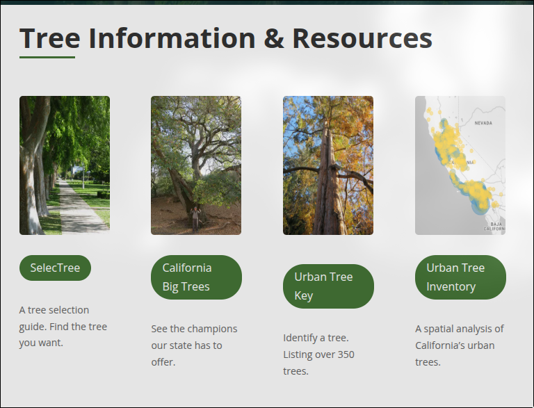
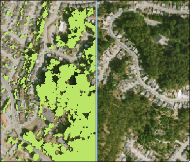
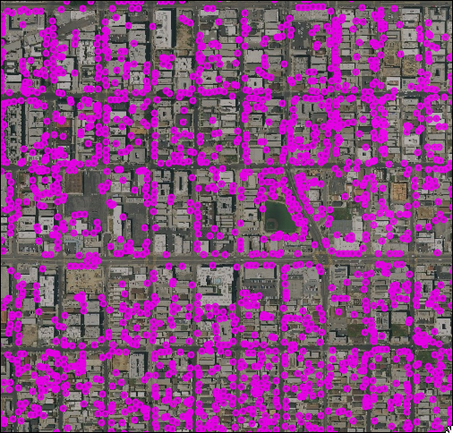
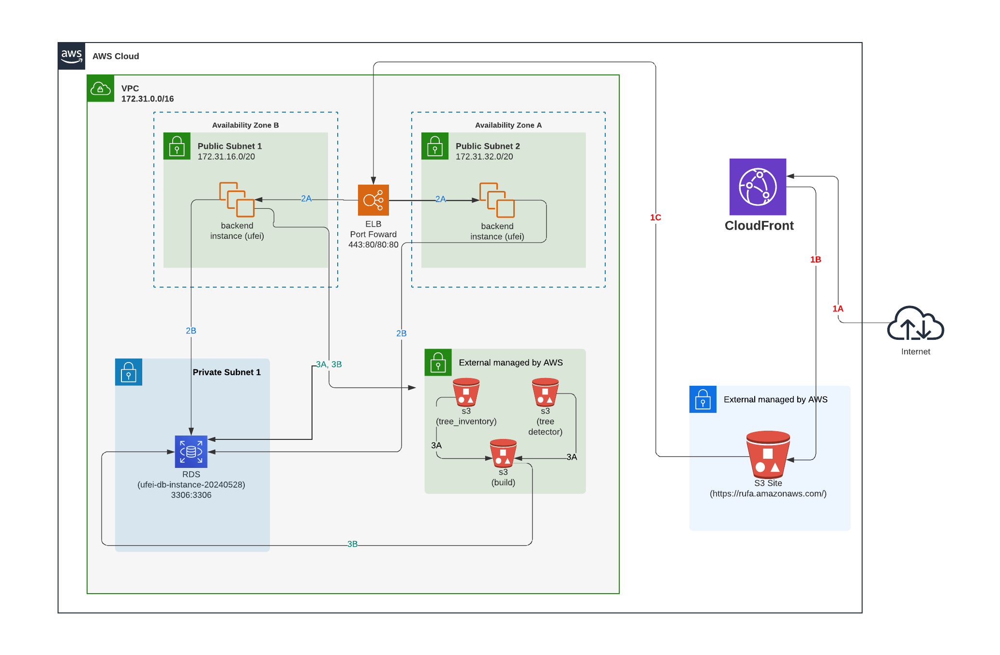

---

# Before RUFA

**Urban Forest Ecosystems Institute (UFEI)** at Cal Poly maintains a suite of public tools for tree selection, identification, and spatial analysis across California.

- **[SelecTree](https://selectree.calpoly.edu/)** — tree selection guide used by **tens of thousands of visitors per month**
- My prior work: engineering and infrastructure on the **SelecTree / UFEI stack** (shared MySQL, APIs, and deployment)
- **[RUFA](https://rufa.calpoly.edu/)** — extends that same institute mission, from species-level guides to **statewide forest assessment**

<!--
Before RUFA, UFEI already operated several tools that the public uses every day 

This includes several projects such as SelecTree, California Big Trees, the Urban Tree Key, and the standalone Urban Tree Inventory.

SelecTree alone draws tens of thousands of monthly visitors and is one of our long on going projects. 

My contributions there are mostly around keeping the infrastructure reliable and scalable

That is the same stack RUFA builds on, which is why, naturally, this project made sense for my thesis

RUFA is a superset of prior tools, providing a normalized view for statewide forest assessment
-->

---

# The Problem

Urban and Community Forestry programs need to answer:

How much tree canopy does this city have?

Are trees equitably distributed?

Is the species mix resilient?

Which cities need intervention?

**Why measurement matters**

- California has among the **lowest urban tree cover per capita** in the U.S.; schoolyards average **~6.4%** median canopy *(Green Schoolyards America, 2022–2024)*
- **~85%** of California elementary schools **lost tree canopy** (2018–2022), with severe losses in the Central Valley *(UC Davis, 2023)*
- California ranks among the **highest tree cover losses** nationwide — wildfire, drought, and pests *(Urban Forestry & Urban Greening, 2021–2024)*

<!--
This project emerged from ongoing urban forestry efforts led by the U.S. Forest Service and its partners.

According to Green Schoolyards America (2022–2024), California has some of the lowest urban tree cover per capita in the U.S., with schoolyards averaging about 6.4% median canopy.

A UC Davis study (2023) covering 2018–2022 found that approximately 85% of California elementary schools lost tree canopy, with the most severe losses occurring in the Central Valley.

Research published in Urban Forestry & Urban Greening (2021–2024) found that California has experienced some of the highest urban tree cover losses in the U.S., driven by wildfire, drought, and pests.

In response, California expanded its Urban and Community Forestry programs to support increased tree planting and maintenance in cities and schoolyards.

To solve a problem as broad as urban forestry, you first need to measure it.

Some of the questions we seek to answer are:

How much tree canopy does a city have?

How are trees distributed?

Is the urban forest mix resilient?

Which cities need intervention?

Where should resources and efforts be prioritized?

Effective urban forest management will begin with measurement.
-->

---

# Enter RUFA:

- **RUFA Score (0–100)** for every California city
- **Interactive map** at city, ZIP, and tract levels
- **Compare** forest health across **702+** places statewide

<!--
Enter RUFA.

RUFA is the UFEI dashboard behind these questions. A planner selects a city and gets a composite RUFA Score plus the four metrics that drive it — canopy, density, diversity, and evenness.

The map supports zoom from statewide view down to ZIP codes and census tracts, so you can compare forest health across California's census-designated places on a common scale.

The rest of the talk covers the data pipeline and engineering that make this dashboard work at scale.
-->

---

# Why RUFA?

RUFA begins with **two complementary datasets**:

- **Inventory data**: species, size, and location from municipal and arborist records
- **Detector data**: tree coordinates from CNN analysis of aerial imagery

Together they support a single platform for planners and stakeholders.

  Contributions

<ul class="mt-2 text-lg font-semibold text-green-700 list-disc pl-6">
  <li>Sub-second database queries over the full inventory.</li>
  <li>Multi-scale map clustering over millions of points.</li>
</ul>

<!--
So why RUFA, and how does it help solve the problem on the prior slides?

RUFA starts from two data sources we already had: detailed inventory records and broad detector tree data from aerial imagery. 

Inventory gives species and structure where cities surveyed trees; 

detection fills spatial gaps with coordinates across the state.

My contribution focused on the system architecture that makes large-scale urban forestry analysis practical

optimizing queries across millions of records and developing multi-scale spatial clustering techniques that maintain interactive performance across all maps.
-->

---

# Agenda

1. **RUFA Score and Tree Records:** Unified tree data and derived urban forest scoring metric.
2. **Data Sources + System Design:** Inventories, CNN detection
3. **Database Design:** Spatial indexing, schema, and materialized views
4. **Clustering:** K-means to SuperCluster and Voronoi

<!--
- I'm going to walk through these four sections today
- If you have questions as we go, feel free to hold them until the end or interrupt if something is unclear.
-->

---
class: text-lg
---

# The RUFA Score

Each component is binned **1–5** against the California distribution, then combined:

$$
\text{RUFA Score} = \left(\frac{\text{CCP}_{\text{bin}} + \text{TD}_{\text{bin}} + \text{TE}_{\text{bin}} + \text{TPC}_{\text{bin}}}{20}\right) \times 100
$$

Equal weight · **0–100** scale · **100** = top quintile on all four · **25** = bottom quintile on all four

<strong>CCP</strong> — Canopy Cover Percentage

<strong>TPC</strong> — Trees Per Capita

<strong>TD</strong> — Tree Diversity (TD-50 index)

<strong>TE</strong> — Tree Evenness

<!--
The formula for the rufa score is deliberately simple.

It takes the binned values of the 4 metrics and scales it to a percentage

The binning step is what makes it powerful

Take canopy cover percentage

Instead of comparing raw canopy percentages across cities of wildly different sizes and geographies, you compare each city's canopy against the California distribution and assign it a 1-through-5 bin.

A city in the second quintile on canopy gets a 2, regardless of whether that means 12% canopy or 35%.

That normalization is what makes scores comparable across cities like Los Angeles and a small Central Valley town.

The equal weighting is a design choice 

Equal weighting keeps the system interpretable and neutral.

The next four slides define each metric a little further
-->

---
class: text-lg
---

# Canopy Cover (CCP)

**Canopy Cover Percentage** — share of land area covered by tree canopy

- **Source:** [EarthDefine](https://www.earthdefine.com/treemap/) **2018** California canopy product — purchased for the state by the **U.S. Forest Service** ([USDA dataset](https://www.fs.usda.gov/detailfull/r5/communityforests/?cid=fseprd647442))
- Percentage of land area with canopy where EarthDefine data overlaps the census-designated place boundary
- Supports California's goal of a **10% urban canopy increase by 2035** (Urban Forestry Act of 1978)

<!--
Canopy Cover comes from EarthDefine's 2018 TreeMap for California, an open dataset the U.S. Forest Service purchased for the state.

For each city we calculate what share of land area is under canopy. 

EarthDefine's urban boundaries do not always align with census-designated places, so Cami computed the percentage only where canopy data exists for that place, but reports it against the full boundary.

Canopy cover is a standard urban forestry metric in California — the 1978 Urban Forestry Act set a statewide goal to increase urban canopy 10% by 2035. 

RUFA lets cities compare their CCP against every other community in the state.
-->

---
class: text-lg
---

# Trees Per Capita (TPC)

**Trees Per Capita** — tree count relative to population size

- Trees in the city's urban area ÷ residents in that city
- **Tree count:** UFEI **TreeDetector** data (Ventura et al. aerial detections)
- **Population:** **2020 U.S. Decennial Census**, stored as `human_population` in the RUFA database

<!--
Trees per capita

For each city we divide tree count within the urban area by the number of people living there.

The numerator is UFEI's TreeDetector dataset — aerial-detected tree coordinates assigned to each place. The denominator is population from the 2020 Census

Trees per capita answers a simple question: how many trees per resident does this city have? It measures overall access to trees and supports goals like planting one tree per resident statewide.

It is an equity metric, not a total-tree count — a large city can have many trees but still score low if population is high or canopy is uneven.
-->

---
class: text-lg
---

# Tree Diversity (TD-50)

**Tree Diversity (TD)** — TD-50 index (Love et al., 2022)

- Rank species by abundance; count how many species are needed to reach **≥ 50%** of all trees in the area
- **Source:** inventory species counts only; the detector provides coordinates, not species labels
- **Low TD-50** (e.g., 2): a few species dominate — high vulnerability to pests and disease
- **High TD-50** (e.g., 20): abundance spread across many species — greater ecological resilience

<!--
Tree diversity measures future resilience. California forests face heat, drought, and pests — if one species dominates and fails, canopy loss can be severe.

TD-50 is the smallest number of species needed to account for half the trees. RUFA computes it from inventory records at refresh time.

Low TD-50 means dominance — if Arizona ash is 40% of a city, one outbreak wipes out a large share of canopy. High TD-50 means risk is spread across many species.
-->

---
class: text-lg
---

# Tree Evenness (TE)

**Tree Evenness** — how uniformly trees are distributed **spatially** within a place

- **How:** subdivide the place into **census blocks**; compute tree density (trees/km²) in each block
- **TE = standard deviation** of those block-level densities
- **Higher TE → less even access** — blocks deviate further from the city-wide average density
- **Example:** TE of 250 means blocks typically sit about **±250 trees/km²** above or below the city average

<!--
Tree evenness is not about species — it is about where trees sit on the map. 

We split each city into census blocks, count trees in each block, and convert that to density in trees per square kilometer.

Tree Evenness is the standard deviation of those block densities. 

A high score means neighborhoods diverge from the city average — trees cluster in parks or wealthier districts while other blocks often fall short.

A city can have decent trees per capita overall and still score poorly on evenness if the distribution is not equitable.
-->

---
layout: default
---

# System Pipeline

<strong class="text-lg">Inventory Records</strong> 
species, size, location

<strong class="text-lg">CNN Aerial Detection</strong> 
detected tree coordinates

▼

<strong class="text-lg">Point-in-Polygon Assignment</strong> 
R-tree spatial lookup

▼

<strong class="text-lg">Relational Schema</strong> 
3NF · MySQL / MariaDB

<strong class="text-lg">Materialized Views</strong> 
cached score rollups

▼

<strong class="text-lg">RUFA Score (0–100)</strong> 
per city · ZIP · tract

<strong class="text-lg">Interactive Map</strong> 
SuperCluster + Voronoi

<!--
explain top down
-->

---

# AWS Architecture Overview

<!--
explain diagram from UI to data
-->
