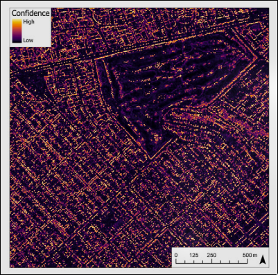

# Tree Records

Inventory records · CNN-detected coordinates · RUFA Score

---

# Inventory Data

The first source: a compiled California urban forest inventory.

- Aggregated from private arborist firms (e.g., West Coast Arborists, Davey Tree Company, APlus Tree Care) and municipal maintenance records
- Public sources: **CAL FIRE** urban forestry program and associated municipal inventories
- Per-tree attributes: **species, genus, family, trunk diameter, canopy spread, height**
- Point coordinates for each inventoried tree
- **Key limitation:** uneven coverage; dense urban cores well-catalogued; many suburbs and lower-income areas have gaps

<!--
- We first begin with the inventoried data
- This is the high-information source in RUFA. These are not just tree dots; they are records collected through municipal inventories and arborist workflows.
- The technical value is the attribute richness: species, genus, family, Width of the trunk, height, and canopy spread let us compute metrics that require biology, not just location.
- TD-50 depends on species counts, so the inventory data acts as the taxonomic ground truth for the score.
- The coordinates also make the records spatially joinable. Once each tree point is assigned to a city, ZIP, or tract polygon, the same raw records can support multiple geographic rollups.
- The weakness is sampling bias. Inventory coverage follows where cities paid for surveys or maintenance, so dense and wealthier municipalities can be overrepresented.
- That means inventory data is precise where it exists, but incomplete as a statewide coverage layer. RUFA needs another source to fill the spatial gaps.
-->

---

# CNN-Based Tree Detection

The second source: a deep learning detection pipeline over aerial imagery.

- Input: **high-resolution multispectral aerial imagery** covering California urban areas
- Architecture: VGG-style fully convolutional network for tree-location heatmap regression (Ventura et al., 2022). https://arxiv.org/abs/2208.10607
- Output: a **confidence map** of detected tree locations
- Result: coordinates for every tree crown — no species attribute (lon/lat only)

<!--
- This source solves the opposite problem from inventory. It gives broad spatial coverage, even in places where no city inventory exists.
- The model uses multispectral aerial imagery, including visible and near-infrared bands, because vegetation has a different spectral signature than pavement, roofs, or bare ground.
- The CNN is fully convolutional, so instead of classifying one image at a time, it scans imagery and produces a heatmap of likely tree crown centers.
- Peaks in that confidence map are converted into point coordinates. For RUFA, the useful output is simple: longitude and latitude for detected trees.
- The tradeoff is that the detector sees tree crowns, not species labels. It cannot tell whether a point is ash, oak, palm, or maple.
- So detected points are excellent for spatial metrics like tree density and trees per capita, but they cannot directly support TD-50 or species evenness.
- This sets up the core data story: inventory gives rich attributes with uneven coverage; CNN detection gives broad coverage with sparse attributes.
-->

---

# Why Both Sources Together

- **Inventory alone**: species-rich data, but many trees and many cities are simply missing
- **Detection alone**: comprehensive spatial coverage, but no species, size, or taxonomy
- **Combined**: RUFA can compute all four score metrics even in partially inventoried cities

The join works through **point-in-polygon spatial assignment**: detected coordinates get associated with place, ZIP, and tract boundaries, then enriched by any overlapping inventory records.

<!--
- The complementarity here is important to understand.
- Canopy cover percentage and trees per capita can be estimated from detected points alone — you just need locations and a population figure.
- But TD-50 species diversity requires species counts, which only come from the inventory.
- So in a city with good inventory coverage, all four metrics are computed from inventory data.
- In a city with poor inventory but good aerial detection, you still get the spatial metrics, but diversity scores are limited or absent.
- The system is designed to degrade gracefully rather than refuse to compute a score entirely.
-->

---

# What We Still Need to Solve

Two datasets are not enough — RUFA must turn them into comparable scores at scale:

- **Assign** millions of tree points to place, ZIP, and tract boundaries
- **Merge** inventory attributes with detector coordinates without double-counting
- **Compute** CCP, TPC, TD-50, and TE at city, ZIP, and tract levels from the same records
- **Serve** dashboard queries in under **200 ms**

<!--
Inventory and detection answer different questions, but the dashboard needs one coherent view.

Before we score anything, every tree point has to land in the right polygon, inventory species data has to attach where it exists, and the results have to roll up cleanly across geographic levels — fast enough for an interactive map.
-->
