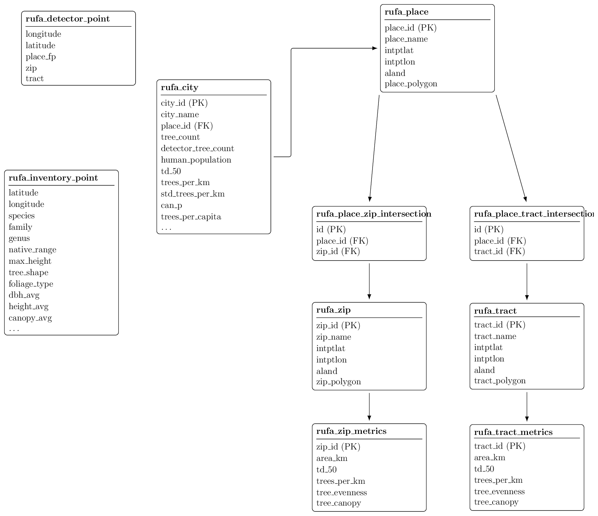
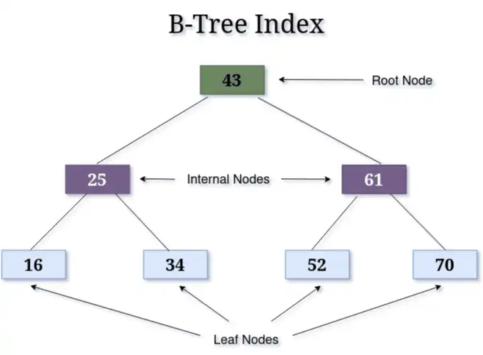
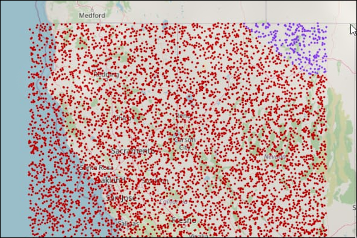
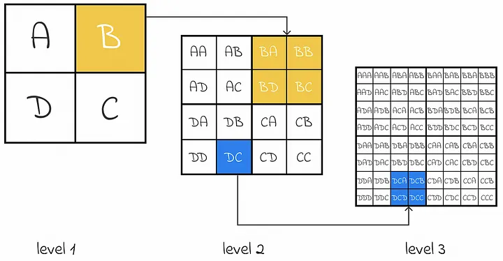
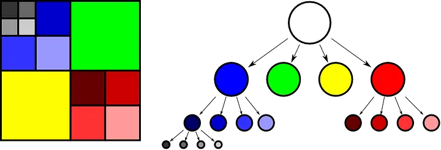
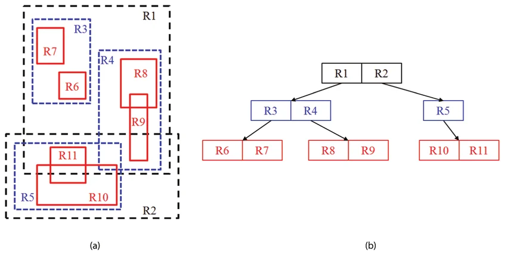

# Database Design

Schema · Spatial indexing · Materialized views · Performance

---

# The Scale Challenge

RUFA's database is not just a data store — it is the performance backbone.

<strong>7.2M</strong> tree detector records

<strong>43M</strong> tree inventory records

<strong>702</strong> city boundaries plus ZIPs and tracts

Every tree needs place, ZIP, and tract assignment, though census place is the primary key

Dashboard reads target <strong>&lt; 200 ms</strong>

Every design decision — indexing strategy, normalization level, refresh mechanism flows from these five requirements.

<!--
- Before diving into the specific techniques, it is worth establishing what the database actually has to do.
- It is not enough to just store records correctly — it has to support very different workloads simultaneously.
- First, spatial ingestion: assigning millions of points to polygons.
- Second, analytical aggregation: computing trees per capita, TD-50, and the other metrics over those assignments. IE tree diversity in Los Angeles.
- A naive relational design can handle any one of these, but handling both at once requires careful design.
-->

---

# Relational Schema

The schema separates raw data, geographic boundaries, and precomputed results.

| Role | Table |
|---|---|
| polygon geometry | `rufa_place`, `rufa_zip`, `rufa_tract` |
| raw tree records | `tree_inventory` |
| CNN tree coordinates | `tree_detected` |
| ready-to-display scores | `tree_stats_by_location` |
| what needs to be updated | `mv_refresh_schedule` |
| which version is live | `mv_version_control` |

<!--
Before we talk about spatial indexes, here is the data model they support.

(go through it)

The next slide shows how these tables connect.
-->

---

# Schema Diagram

<!--
explain from the source

rufa city is the main table

mention zip and tract metrics
-->

---

# B+ Tree Indexes

A **B+ tree index** is a sorted, layered lookup structure. The database follows branches to narrow the search instead of reading the whole table.

- **Row by row:** O(n) — scan millions of records
- **B+ tree:** O(log n) — jump toward the matching rows
- MySQL / MariaDB use B+ trees for standard indexes (including primary keys)

This idea comes back when we talk about spatial indexes and dashboard query performance.

<!--
B+ trees vs row per row ingestion is like

reading every page of a phone book versus opening to the right letter and going straight to the name

As the diagram shows, values are organized in branches from low to high.

The database compares the search key at each level and narrows the branch instead of scanning the whole table, allowing us to reach our desired field in O(log(n)) time instead of O(n).

That same idea can extend to spatial indexing next
-->

---

# Naive Proximity Search

The simple idea: draw a box around the area we care about, then ask the database for trees inside it.

<strong>1. Draw a box</strong> 
Limit the search to a rough area.

<strong>2. Check distance</strong> 
Remove points outside the radius.

<strong>3. Return matches</strong> 
Show trees near the target.

This works for small data. At RUFA scale, the box can still include a huge number of trees, so the database may still check far too many rows.

<!--
- RUFA at it's core boils down to a problem of proximity search
- A problem solved by day to day tools like google maps for example
- in short we are given sets of dynamics points and are looking to see if they fit within a static polygon, ie: rufa polygon. This can be a census tract, zip, or census place
- Given this, how do we retrieve the data we need
- The baseline and what most will reach for is to add a bounding box around the latitude and longitude ranges.
- This bounding box is cheap to express as a range query on lat and lon columns.
- In a dense city like Los Angeles, a bounding box around a neighborhood could contain tens of thousands of rows.
- even If the lat and lon columns have ordinary B-tree indexes, each index prunes one dimension but not both simultaneously.
- The result is that even a moderately selective lat range still leaves a huge candidate set for the lon filter to scan.
- That is the 1D index saturation problem.
- And that is whats unique to the rufa problem as most indexes in databases design revolve optimization around a single field
-->

---

# Two Families of Spatial Index

**Hash-Based**

Split the map into boxes, like a grid.

Fast and easy. Cell size is the key tradeoff; too big and you over-include, too small and you fragment.

**Example: Geohash**

**Tree-Based**

Organize space hierarchically. Each level subdivides the level above.

Better for irregular density (hint hint)

**Examples: Quadtree, R-tree**

<!--
- There are two big families of spatial index, and they take fundamentally different approaches.
- Hash-based: divide the world into a fixed grid and bucket records into cells. Geohash is the classic example.
- Tree-based: build a tree where each node represents a region of space, and subdivide regions as needed. Quadtree and R-tree both work this way.
- The next two slides go into Geohash and Quadtree because they illustrate the tradeoffs cleanly. Then we'll land on R-tree, which is what RUFA actually uses for polygon membership.
-->

---

# Geohash — Hash-Based

Encode a coordinate into a short string. Nearby strings = nearby places.

<strong>Easy to implement</strong> 
Just a string prefix lookup. Works in any database.

<strong>Fixed precision per level</strong> 
Each character of the string halves the cell size.

**Bottom-up search**: start small, expand outward until you find what you need.

> Example: "find a gas station within 10–20 miles" -> Expand the geohash precision until you've gathered enough candidates, or the radius is exhausted.

<!--
- Geohash is the simplest hash-based spatial index. It turns a lat/lon pair into a short string
- The clever property is that strings that share a prefix are geographically close. "ABAB" is a neighborhood of "ABAA".
- That means proximity queries become string prefix lookups, which any database with a B-tree on a string column can do.
- The implementation simplicity is the main selling point. There's no special index type, no spatial library — just a string column and a regular index.
- The fixed-precision-per-level property means you choose how granular your buckets are. Each additional character roughly halves the cell dimensions.
- This is intuitive for "find me the nearest N things" queries: keep widening the bucket until N things are inside.

The main issues with this approach

- Nearby points can fall into different GeoHashes, so you miss close matches unless you also check neighboring cells for example if we place LA in the middle of all 4 quadrants
- Additionally, Cells aren’t consistent in real-world distance due to Earth's curvature and latitude effects
- Fixed precision levels, GeoHash uses discrete lengths, which may miss points when applying polygons
-->

---

# Quadtree — Tree-Based

Recursively split each region into four quadrants. Subdivide only where data is dense.

<strong>Adapts to density</strong> 
Empty regions stay as big cells. Dense urban cores get finely subdivided automatically.

<strong>Slightly harder to implement</strong> 
Needs a real tree structure, not just a string column.

**Top-down search**: start with the whole map, descend into smaller quadrants until you have enough matches.

> Example: "find businesses near a point" -> Start at the county level, drill down into the relevant quadrant, keep splitting until the cell contains a useful candidate set.

<!--
- Quadtree is the canonical tree-based spatial index. The idea is simple: take the whole map as one cell, split it into four equal quadrants, and recursively split any quadrant that has too many records in it.
- The result is a tree where empty rural areas stay as one big cell at the top, but dense city centers get split many times into very small cells at the bottom.
- This density-adaptive behavior is the key advantage over fixed-grid approaches like geohash. Los Angeles and a rural county can coexist in the same index without forcing a compromise on cell size.
- The implementation cost is higher because you need an actual tree data structure with parent-child pointers and rebalancing logic when records get inserted or deleted.
- Search is top-down: start at the root, find which quadrant contains the query point, descend into that quadrant, repeat until the cell is small enough to enumerate.
- For "find k nearest things" you keep descending until you have at least k candidates in your cell and possibly its neighbors.
- Quadtrees are great for points. For polygons — which is what RUFA actually needs — R-trees do this better, which is the next slide.
-->

---

# R-tree — RUFA's Choice

Each city, ZIP, and tract gets a **rectangle** drawn around it. The R-tree groups nearby rectangles into bigger rectangles.

When RUFA places a tree on the map, the R-tree quickly rejects rectangles that are nowhere near that tree.

<strong>Built for polygons</strong> 
Cities, ZIPs, and tracts are real shapes — not points. R-trees were designed for exactly this.

<strong>Native in MySQL</strong> 
Mark a column `SPATIAL` and MySQL builds an R-tree automatically.

<!--
- The R-tree is the spatial index RUFA actually uses, and the reason is that RUFA's main spatial workload is polygon membership: assigning a tree point to its containing city, ZIP, and tract.
- Quadtrees and geohashes are good for points. R-trees are good for shapes.
- Each polygon — say, the boundary of San Francisco — gets a minimum bounding rectangle drawn around it. That rectangle is what the R-tree stores.
- The tree then groups nearby polygon rectangles into bigger parent rectangles, and groups those into even bigger grandparent rectangles, all the way up to the root.
- When you query with a tree point, the R-tree walks down from the root and rejects any parent rectangle that doesn't contain the point. By the time you reach the leaves, you have a tiny candidate set.
- The other major reason for R-tree: MySQL supports it natively. You declare a column as SPATIAL and the engine builds the R-tree behind the scenes. No external library, no schema gymnastics.
-->

---

# RUFA Spatial Lookup — Two Phases

<h3>1. Fast guess</h3>
Use the R-tree to find the few city, ZIP, or tract polygons that might contain the tree.

<h3>2. Exact check</h3>
Use `ST_Contains` to confirm the tree is actually inside the polygon.

This gives RUFA both speed and correctness: it avoids scanning everything, but still handles messy real-world boundaries.

<!--
- The two-phase strategy is the most important algorithmic idea in the database section.
- Phase one is fast but approximate: the MBR of a polygon is larger than the polygon itself, so you can get false positives where a point is inside the MBR but outside the actual polygon.
- That is fine — the R-tree is not meant to give you exact answers, it is meant to give you a very small candidate set very quickly.
- Phase two is slow but exact: ST_Contains runs the actual point-in-polygon algorithm on the polygon's true boundary.
- The correctness benefit is significant: California has many irregular polygon shapes — coastal cities, cities with holes, census tracts that follow highways.
- Without exact containment testing, you would misassign trees near boundaries.
- With the two-phase approach, you get both speed and accuracy.
-->

---

# MySQL / MariaDB

RUFA uses MySQL/MariaDB because it fits the existing Selectree system.

PostGIS would be stronger for advanced GIS work, but switching databases would mean rewriting existing tools and pipelines.

The important point: MySQL still supports the spatial index RUFA needs for fast polygon lookup.

<!--
- This is an honest engineering tradeoff.
- PostgreSQL with PostGIS is objectively more capable for spatial workloads.
- It has better index types, a much richer spatial function library, native coordinate reference system transformations, and true materialized views with concurrent refresh.
- But all of those require migrating away from the existing infrastructure, which means rewriting every Selectree integration and every data pipeline.
- RUFA's thesis is that you can deliver a high-quality spatial system within the MySQL constraint
-->

---

# RUFA should not recompute scores every time

For one city, the score needs several expensive metrics:

Canopy cover

Trees per capita

TD-50 diversity

Tree evenness

Instead, RUFA computes the scores ahead of time and stores them in `tree_stats_by_location`.

The dashboard reads the saved answer quickly. The expensive recalculation happens later, in the background.

<!--
- A materialized view is a cached query result stored as a table.
- PostgreSQL has native support for them with REFRESH CONCURRENTLY, which lets you rebuild the cached table without locking out readers.
- MariaDB does not have this feature.
- What RUFA does instead is maintain regular tables that hold the same pre-computed results, and then manages the refresh lifecycle explicitly: a trigger marks a row as stale when underlying data changes, a batch job recomputes the stale rows on a schedule, and an atomic table swap publishes the new results.
- This is more operational complexity than native materialized views, but it achieves the same outcome — dashboard queries read from fast, pre-computed tables rather than running expensive aggregations on the fly.
-->

---

# Geographic Cascade Architecture

When one place changes, nearby summary levels may need to change too.

Example: if a city's tree inventory changes, RUFA may also need to update its ZIP codes, census tracts, and county totals.

The `location_relationships` table stores those connections so updates can cascade automatically.

<!--
- The cascade requirement comes from how the dashboard presents data.
- A user looking at a map can see city-level scores, then zoom into ZIP codes, then census tracts — all on the same screen.
- If a city's tree inventory was just updated but the ZIP scores haven't refreshed yet, the user would see inconsistent numbers: the city score says 72 but the ZIPs inside it average to 58.
- That mismatch destroys trust in the data.
- This location_relationships table is what prevents this: it is a pre-computed mapping from "this city" to "all the ZIPs and tracts that intersect it," built at database setup time.
- When the refresh stored procedure processes a stale city, it looks up all related geographic levels in location_relationships and marks them for refresh too.
- The cascade is automatic and the dashboard always sees a logically consistent snapshot.
-->

---

# Refresh Strategy

Refresh pipeline: **mark stale → recompute → publish**.

<strong>1. Mark stale</strong> 
Tree data changed here.

<strong>2. Recompute</strong> 
Batch job rebuilds scores.

<strong>3. Publish</strong> 
Dashboard gets the finished version.

<!--
- Let me walk through each layer.
- The trigger fires automatically after any INSERT into tree_inventory — it simply sets a boolean flag in mv_refresh_schedule.
- This is cheap: it is a single UPDATE to one row.
- The flag accumulates over time as inventory records come in.
- The batch job — which runs on a cron schedule — opens a cursor over all rows where needs_refresh is TRUE and calls CalculateRUFAScore for each one.
- This is where the expensive computation happens, but it happens off the critical path, not during a dashboard request.
- The atomic swap in layer three is the most technically interesting part: RENAME TABLE in MySQL acquires a metadata lock and swaps the table names in a single atomic operation.
- Dashboard queries will either see the old complete table or the new complete table — they can never see a half-populated temporary table.
- This eliminates transient inconsistency entirely.
-->

---

# Performance Benchmark — Setups Tested

Compared **four storage and indexing strategies** on a production-scale dataset:

| Setup | Description |
|---|---|
| **S3 — single CSV** | Entire 7.2M-record file on object storage |
| **S3 — per-city CSV** | One file per city, fetch only what you need |
| **MySQL — no index** | Relational table, full table scan on city lookup |
| **MySQL — tree index** | Same table, indexed city column |

**Test environment:** AWS EC2 **t3.large** (2 vCPU, 8 GB RAM) · **MariaDB 10.5.23** on Amazon RDS

**Dataset:** **7.2 million** tree records across **702** California cities

<!--
In order to benchmark our database  

we set up a manifest for fetching all the points of a given census place and run this test for all given cities

the first set up involves us fetching of the full s3 csv file directly and then parsing the desired city

the second being a pre split set of csvs where we essentially directly fetch all the points for the city

the third being the raw points bootstrapped onto the MySQL database without an index

and the last being the same table with the previous discussed index applied to the database

we run this test on a t3.large AWS machine, talking to MariaDB on RDS, using the full California inventory scale — 7.2 million rows, 702 cities. Give or take
-->

---

# Performance Benchmark — Workload & Results

**Workload:** city-specific query — retrieve all tree inventory rows for one census place (typical dashboard request)

- **100 executions** per setup · timing via MySQL profiling
- **Target:** sub-**200 ms** dashboard reads

| Storage Strategy | Avg. Latency | Std. Dev | Throughput |
|---|---:|---:|---:|
| S3 — single CSV file | 8,450 ms | ±1,230 ms | 0.12 q/s |
| S3 — per-city CSV files | 3,120 ms | ±480 ms | 0.32 q/s |
| MySQL table, no index | 2,890 ms | ±290 ms | 0.35 q/s |
| **MySQL table, B-tree index** | **145 ms** | **±25 ms** | **6.90 q/s** |

**Takeaway:** indexed MySQL brings reads under the 200 ms target — RUFA precomputes the hard work, then serves simple indexed lookups.

<!--
The workload mirrors what the dashboard actually does: given a city name, return that city's trees.

Each setup ran 100 times for stable averages. 

S3 single-file pays download and parse cost on all 7.2 million rows every time. 

Per-city CSV is better but still parses on every request.

Unindexed MySQL avoids file I/O but scans O(n). 

Lastly, the B-tree index on city drops latency to 145 ms — a 95% improvement — with low variance, which is what you need for interactive use.
-->
