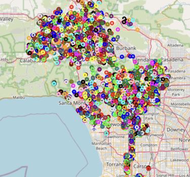
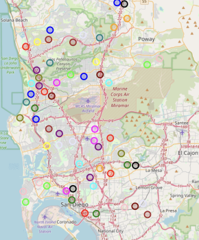
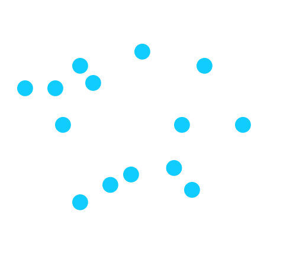
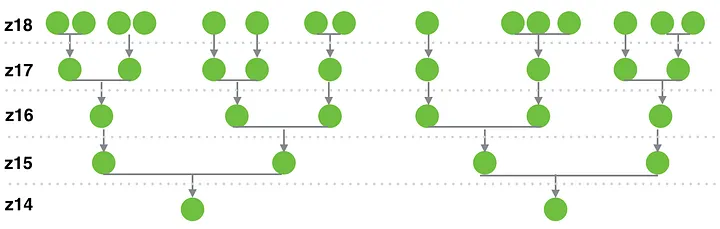

# Clustering

K-means · Grid-based · Hierarchical · SuperCluster + Voronoi

---

# The Visualization Problem

Rendering 7 million individual tree points on a web map is not feasible.

<div class="grid grid-cols-2 gap-4 mt-6">
<div>Browser maps degrade around <strong>10k–50k</strong> visible elements</div>
<div><strong>7M</strong> markers is unusable at city scale</div>
<div>Overlapping dots hide spatial patterns</div>
<div>Users need zoom-appropriate aggregation</div>
</div>

**Requirements**: zoom-adaptive aggregation, preserved forest metrics per region, fast re-render on pan/zoom, GeoJSON-compatible output.

<!--
- This is a frontend performance problem as much as it is an algorithmic one.
- Web map libraries like Leaflet and Mapbox GL render points using the browser's canvas or WebGL pipeline.
- Even with WebGL acceleration, rendering 6.6 million points simultaneously saturates GPU memory and fills the screen with undifferentiated color — there is no information gain from showing every individual tree at the city scale.
- What you actually want is: at zoom level 5 (state scale), show me regional density clusters.
- At zoom level 10 (neighborhood scale), show me individual neighborhoods.
- At zoom level 15 (street scale), show me individual tree points.
- Each zoom level needs a different level of aggregation, and switching between them needs to be instant.
- That is the core requirement the clustering system has to satisfy.
-->

---

# K-Means: First Approach

K-means groups nearby trees together by repeatedly answering one question:

> *"Which cluster center is each tree closest to?"*

<div class="grid grid-cols-3 gap-4 mt-6">
<div class="p-4 rounded bg-green-50">
<strong>1. Pick centers</strong><br />
Drop <code>k</code> starting points on the map.
</div>
<div class="p-4 rounded bg-green-50">
<strong>2. Assign trees</strong><br />
Each tree joins its nearest center.
</div>
<div class="p-4 rounded bg-green-50">
<strong>3. Move centers</strong><br />
Each center shifts to the middle of its trees. Repeat.
</div>
</div>

<div class="mt-5">
Works on small data. At <strong>7M trees</strong> it is too slow, and one fixed <code>k</code> cannot handle both dense downtowns and sparse suburbs at the same time (Los Angeles VS Half Moon Bay)
</div>

<!--
- K-means is the first thing most people reach for when they want to cluster points.
- The intuition is simple: you decide up front how many clusters you want — that is the k — and then you let the algorithm sort the trees into those groups.
- Step one: drop k starting points anywhere on the map. These are your initial cluster centers.
- Step two: every tree looks at all the centers and joins the one it is closest to. Now every tree belongs to a cluster.
- Step three: each cluster center moves to the average position of all the trees that joined it. Then you repeat — trees reassign to their new nearest center, centers move again — until nothing changes.
- It works well on small data and the clusters look sensible. The problem is scale: with 7 million trees and several hundred clusters, each pass through the data takes a long time, and you need many passes to converge.
- The other problem is that k is fixed. If you pick k = 100, that is the same level of detail for downtown Los Angeles as it is for Half Moon Bay — but those two places need very different amounts of clustering.
- So k-means was the baseline, it taught us what we needed, and we moved on to approaches that handle scale and variable density better.
-->

---

# K-Means: Density Still Breaks It

We tried making <code>k</code> a function of tree count, so bigger cities received more clusters.

<div class="grid grid-cols-2 gap-5 mt-4">
<div>

<p class="text-center text-sm mt-2 opacity-75">Los Angeles: dense areas still dominate the clusters</p>
</div>
<div>

<p class="text-center text-sm mt-2 opacity-75">San Diego: lower-density areas need different granularity</p>
</div>
</div>

<div class="mt-4">
Tree count helps choose <code>k</code>, but density still varies inside each city. One city can contain downtown blocks, suburbs, parks, and empty areas, so K-means still over-clusters some places and under-clusters others.
</div>

<!--
- These examples show why simply scaling k as a function of the number of trees present.
- Los Angeles has very dense urban regions, so a tree-count-based k tends to spend many clusters where the data is already dense.
- San Diego has a different spatial pattern, so the same rule does not translate cleanly.
- The failure mode is not just total size; it is uneven density within the same geographic area.
- This is why RUFA moves toward clustering that adapts to zoom level and spatial density instead.
-->

---

# SuperCluster: Greedy Clustering

Greedy clustering is a simple way to group points for one map zoom level.

<div class="grid grid-cols-[1fr_0.95fr] gap-6 mt-4 items-start">
<div>

<div class="space-y-2">
<div><strong>1.</strong> Start with any unclustered point.</div>
<div><strong>2.</strong> Find nearby points within a radius.</div>
<div><strong>3.</strong> Form one cluster from those points.</div>
<div><strong>4.</strong> Pick another unclustered point and repeat.</div>
</div>

<div class="mt-5 p-4 rounded bg-green-50">
Doing this separately for every zoom level is too expensive. For zoom levels 0 through 18, RUFA would process the whole dataset 19 times.
</div>

</div>
<div>



</div>
</div>

<!--
- This slide introduces the basic greedy clustering idea before explaining SuperCluster by MapBox
- For one zoom level, the approach is intuitive: take a point, gather nearby points, form a cluster, then move to the next unvisited point.
- The problem is repetition across zoom levels.
- A map usually has many zoom levels, often 0 through 18. If we run this clustering process from scratch for each zoom, the full dataset gets scanned again and again.
- Lower zoom levels also become harder because one cluster may need to represent an exponentially larger number of points.
- SuperCluster solves this by building a hierarchy once, then reusing it across zoom levels.
-->

---

# SuperCluster: Reuse the Work

SuperCluster avoids reclustering the full dataset at every zoom level.

<div class="grid grid-cols-[1fr_0.95fr] gap-6 mt-4 items-start">
<div>

<div class="space-y-3">
<div><strong>Start at high zoom:</strong> cluster the original tree points at z18.</div>
<div><strong>Move upward:</strong> group those clusters into z17 clusters, then z16, and so on.</div>
<div><strong>Use weighted centroids:</strong> bigger clusters carry more weight when the next level is formed.</div>
</div>

<div class="mt-5 p-4 rounded bg-green-50">
Each zoom level has its own spatial index, so RUFA can quickly answer: "which clusters are visible on this screen?"
</div>

</div>
<div>



</div>
</div>

<!--
- Instead of running the same expensive radius search against the original tree points for every zoom level, SuperCluster reuses the previous level.
- At the most detailed zoom level, it clusters actual points. The next zoom level clusters those clusters using weighted centroids.
- Because every level has fewer inputs than the level below it, the amount of work drops quickly as the map zooms out.
- This idea is hierarchical greedy clustering, popularized by Dave Leaver's Leaflet. markercluster plugin.
- SuperCluster also builds a spatial index at each zoom level. That solves two expensive operations: finding nearby points within a radius and finding clusters inside the current map viewport.
- The result is fast enough for millions of points and good enough for interactive map browsing.
-->

---

# Voronoi Diagrams — Spatial Regions

SuperCluster gives you **cluster centers**. Voronoi diagrams give you **spatial regions**.

```python
def process_voronoi(cluster_points, zoom):
    vor = Voronoi(cluster_points)          # Fortune's algorithm — O(n log n)
    polygons = create_polygons_from_voronoi(vor)

    for polygon in polygons:
        area_km2 = calculate_area(polygon)
        trees_in_cell = count_trees_in_polygon(polygon)

        tree_density  = trees_in_cell / area_km2
        diversity     = calculate_td_50(polygon)   # same function from data sources

        add_feature_to_geojson(polygon, tree_density, diversity)
```

Voronoi tessellation turns cluster centers into map regions. Each cell supports tree density, TD-50 diversity, color mapping, and cached GeoJSON output.

<!--
- A Voronoi diagram takes a set of points — in this case, the SuperCluster centroids — and partitions the plane into cells such that every location in a cell is closer to that cell's seed point than to any other seed.
- This gives you natural spatial regions for every cluster.
- Fortune's algorithm computes this in O(n log n) time using a sweep line approach.
- The practical benefit is that these cells give the user a geographic region to interact with on the map — not just a dot.
- When you hover over a Voronoi cell, you see: this cell covers 12 square kilometers, contains 4,200 trees, has a TD-50 of 8.
- That is much more informative than a single point marker.
- Notice that the calculate_td_50 function here is the same function we looked at in the data sources section — the same algorithm runs at city scale for the RUFA Score and at Voronoi cell scale for the map visualization. Code reuse across scales.
-->

---

# Clustering Performance and Output

**Complexity summary:**

| Approach | Complexity | 7M Trees (est.) | Multi-scale? |
|---|---|---|---|
| K-means | O(nkt) | ~140 min | No — rerun per zoom |
| Grid-based | O(n) | ~10 sec | Limited |
| Hierarchical | O(n³) | Infeasible | Yes |
| **SuperCluster + Voronoi** | **O(n log n)** | **~45 sec** | **Yes — single index build** |

Output capabilities:

Valid **GeoJSON** supports Leaflet, Mapbox GL, and Deck.gl. Density maps are color-coded per Voronoi cell, TD-50 is calculated per cell.

<!--
- The complexity comparison tells the story clearly.
- K-means at O(nkt) would take over two hours for the full dataset.
- Grid-based is fast but lacks the spatial richness.
- Hierarchical is simply infeasible at this scale.
- SuperCluster plus Voronoi achieves the O(n log n) complexity of the best sorting algorithms, processes the full 7 million point dataset in under a minute.
- Once the cache is built, the marginal cost of serving the clustering visualization to any number of dashboard users is essentially zero.
- The GeoJSON output format is the universal language of web mapping — any modern map library can consume it directly without transformation.
-->
